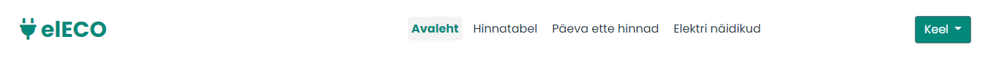
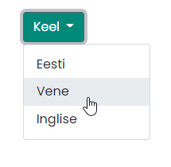
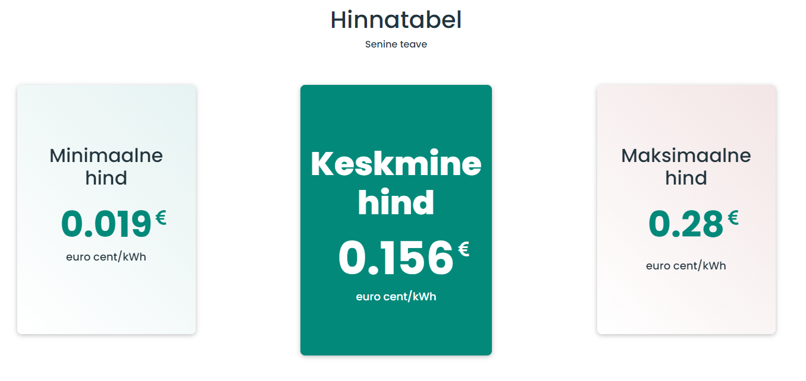
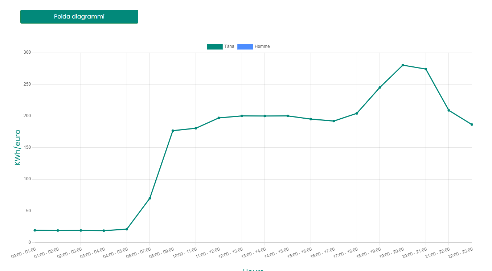
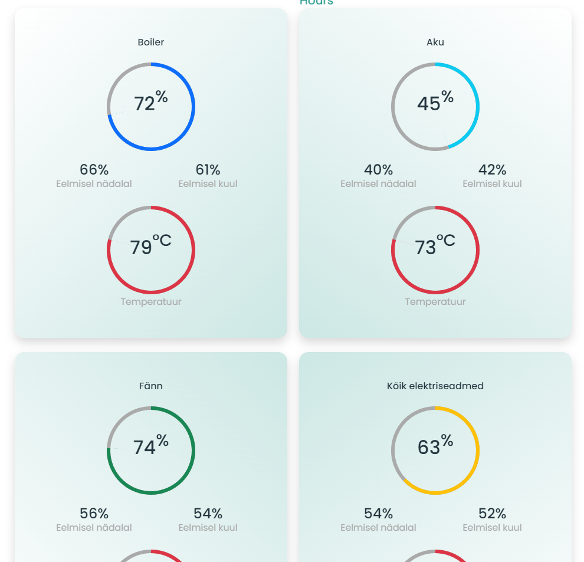
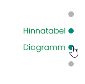

Our goal was to create a website with a good design and useful functionality.

When you visit the site, the first thing you will see is the top link bar.

Kui klõpsate nupul "Avaleht", suunatakse teid tagasi navigeerimisribale

Mugavuse huvides on saidil ka keelelüliti, saate valida mis tahes kolmest keelest, valides selle paremas ülanurgas

Nupp "Hinnatabel" viib teid tänase kohtuvaidluse börsi minimaalse, maksimaalse ja keskmise hinna arvutustega jaotisse

Nupp "Päeva ette hinnad" viib Sind tunnigraafikusse, kus on aktsiahinnad iga tunni kohta Nord Pool Spoti börsilt tänaseni ja homseni, hinda mõõdetakse KWh/senti. Mugavuse huvides on tehtud nupp "Peida diagrammi", see on mõeldud graafiku peitmiseks. Diagrammi hindu uuendatakse automaatselt ja sünkroonitakse börsihindadega

Nupp "Elektri näidikud" viib teid virtuaalsete elektritarbimise arvestite juurde

Kui liigutate lehte allapoole, ilmub saidi paremale küljele väike navigeerimisriba, mis aitab teil saidil navigeerida

